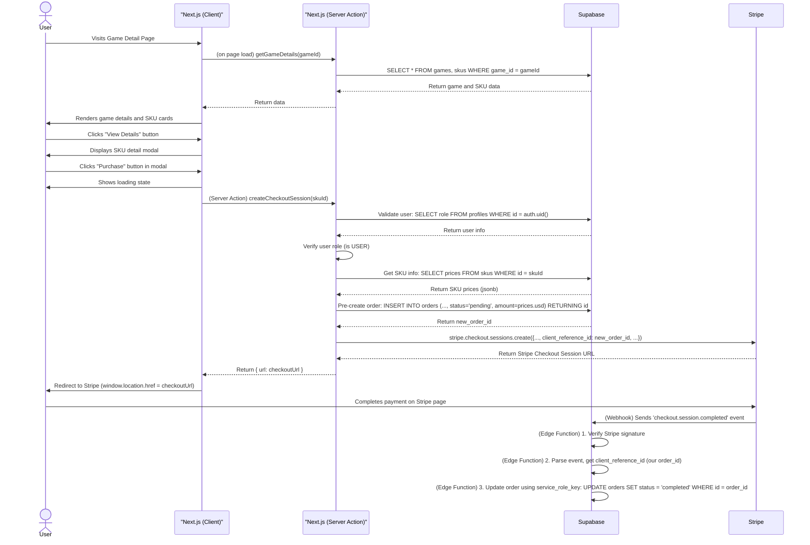

---

```markdown
# Product Requirements Document (PRD): Game Recharge Platform

- **Version**: 1.1 (Final Locked)
- **Status**: CONFIRMED & READY FOR DEVELOPMENT
- **Lead Product Designer**: Gemini-Pro
- **Stakeholder**: You

## 1. Mission
To build a seamless, multi-language, multi-tenant game top-up platform that provides a convenient purchasing experience for players and a powerful sales management backend for game merchants.

## 2. Product Roadmap

### 2.1. User Personas
1.  **Player (Gamer) - Alex**: Wants a unified, secure, third-party website to quickly complete in-game purchases and easily track his spending history.
2.  **Game Merchant - Kenji**: Wants to expand sales channels for in-game items at a low cost and needs a simple way to manage products (SKUs) and view order data.
3.  **Platform Administrator - You**: Needs a god-view dashboard to manage all merchants, games, and orders to ensure the platform operates smoothly.

### 2.2. V1: Minimum Viable Portfolio (MVP)
*   **Module 1: Global Platform & Player Experience**: Game homepage, game detail page, EN/ZH language switching, and responsive design.
*   **Module 2: Unified Account System**: Email/password registration, Google/Apple SSO login, user profile center, and order history.
*   **Module 3: Core Purchase Flow**: SKU selection, item detail modal, Stripe Checkout integration, and payment confirmation via webhooks.
*   **Module 4: Merchant Portal**: Merchant login, data dashboard, game management (CRUD), SKU management (CRUD), and order lookup.
*   **Module 5: Admin Portal**: Admin login, merchant management (CRUD), game moderation, and a platform-wide order view.

### 2.3. V2 & Future Releases
*   Full multi-currency pricing support for merchants (UI & Backend).
*   Advanced data analytics and visualization charts.
*   Discount code and promotion system.
*   Merchant settlement and withdrawal system.
*   Integration of more payment methods (e.g., PayPal, Alipay).

## 3. V1 (MVP) Core Design & UX

### 3.1. Selected Design Concept: Concept A - "Immersive Card"
We will faithfully replicate the core visual and interactive logic of the reference site `app-pay.jp`, prioritizing high visual impact and informational integrity. This involves a "view details first, then purchase" two-step interaction model to ensure the portfolio project has a high degree of stylistic consistency and professionalism.

### 3.2. ASCII Prototype: Concept A (English UI)

**Flow: [Game List] -> [Game Detail Page] -> [Purchase Modal]**

```
// 1. Game List (Home Page)
+----------------------------------------------------+
| [Logo] AppPay          [EN/ZH]    [Login/Alex]     |
+----------------------------------------------------+
|                                                    |
|  +---------------------------+                     |
|  |                           |                     |
|  |  [  GAME BANNER IMG  ]    | (click)             |
|  |                           |                     |
|  +---------------------------+                     |
|  | > Game Title A            |                     |
|  +---------------------------+                     |
|                                                    |
|  +---------------------------+                     |
|  |                           |                     |
|  |  [  GAME BANNER IMG  ]    |                     |
|  |                           |                     |
|  +---------------------------+                     |
|  | > Game Title B            |                     |
|  +---------------------------+                     |
|                                                    |
+----------------------------------------------------+

// 2. Game Detail Page
+----------------------------------------------------+
| [<- Back] Game Title A         [EN/ZH]    [Alex]   |
+----------------------------------------------------+
|                                                    |
|  [         LARGE GAME BANNER AT TOP         ]      |
|                                                    |
|  Game description text goes here...                |
|  --------------------------------------------      |
|  【Select Your Item】                                |
|                                                    |
|  +---------------+  +---------------+  +---------------+
|  | [SKU Img]     |  | [SKU Img]     |  | [SKU Img]     |
|  | Crystals x36  |  | Crystals x91  |  | Crystals x174 |
|  | $10.99 USD    |  | $25.99 USD    |  | $49.99 USD    |
|  | [ View Details ]|  | [ View Details ]|  | [ View Details ]| (click)
|  +---------------+  +---------------+  +---------------+
|                                                    |
+----------------------------------------------------+

// 3. Purchase Modal
+----------------------------------------------------+
|                        [ X ]                       |
|          +----------------------------+            |
|          |                            |            |
|          |   [    LARGE SKU IMG     ] |            |
|          |   [   3x IN-GAME BONUS!  ] |            |
|          |                            |            |
|          +----------------------------+            |
|                                                    |
|          Crystals x36                              |
|          - 32 Base Crystals                        |
|          - 4 Bonus Crystals                        |
|                                                    |
|          Price: $10.99 USD                         |
|                                                    |
|          +----------------------------+            |
|          |         Purchase          | (To Stripe)  |
|          +----------------------------+            |
|                                                    |
+----------------------------------------------------+
```

## 4. V1 (MVP) Architecture Blueprint

### 4.1. Core Flow Diagram (User Purchase Journey)



### 4.2. Component Interaction
*   **`app/[locale]/games/[gameId]/page.tsx`**: A Server-Side Component (RSC) that fetches and renders game and SKU data.
*   **`components/sku-card.tsx`**: A Client-Side Component that displays SKU info and triggers a global modal via a Zustand store.
*   **`components/modals/sku-detail-modal.tsx`**: A global Client-Side Component modal that displays content based on the Zustand store and contains the "Purchase" button that triggers a Server Action.
*   **`src/actions/payment.ts`**: The Server Action module defining `createCheckoutSession`, responsible for validation, pre-creating a `pending` order in the DB, and calling the Stripe SDK.
*   **`app/api/webhooks/stripe/route.ts`**: The webhook handler that validates the Stripe signature and updates the order status in the database upon successful payment.

### 4.3. Tech Stack & Risks
*   **Key Technology Choices**: Server Actions, Supabase RLS, `next-safe-action`, Stripe `client_reference_id`.
*   **Potential Risks**:
    *   **Webhook Reliability**: The webhook handler must be idempotent to handle Stripe's retry mechanism gracefully.
    *   **RLS Policy Complexity**: Extensive database tests are required to verify that multi-tenant data isolation is working correctly.
    *   **Serverless DB Connections**: Supabase PgBouncer must be correctly configured and enabled to prevent connection exhaustion.

## 5. V1 (MVP) Key Business Logic
1.  **Roles & Permissions (RLS)**:
    *   **USER**: Can read all `games`/`skus`; can perform CRUD on their own `profiles`/`orders`.
    *   **MERCHANT**: Inherits USER permissions; has full CRUD access to `games`, `skus`, and `orders` associated with their own `profile.id`.
    *   **ADMIN**: Superuser, bypasses all RLS policies.
2.  **Internationalization**: Text fields (`name`, `description`) in `games` and `skus` tables use the `jsonb` type with a structure of `{ "en": "...", "zh": "..." }`.
3.  **Order Status**: The `orders` table includes a `status` field (enum: `pending`, `completed`, `failed`) to track the payment lifecycle.
4.  **Currency Strategy**:
    *   V1 of the platform will operate exclusively in **USD**.
    *   The database schema (`skus.prices`) is architected to support multiple currencies in the future.
    *   For V1, all application logic will be hardcoded to create, read, and update only the `usd` key within the `prices` jsonb object. The price value must be stored in its smallest unit, cents (e.g., $10.99 is stored as 1099).

## 6. V1 (MVP) Data Contract
*   **`profiles`**: `id (uuid, pk, references auth.users.id)`, `role (enum: USER | MERCHANT | ADMIN)`, `merchant_name 
*   **`games`**: `id`, `name (jsonb)`, `description (jsonb)`, `banner_url`, `merchant_id (fk to profiles.id)`.
*   **`skus`**: `id`, `name (jsonb)`, `description (jsonb)`, **`prices (jsonb)`**, `image_url`, `game_id (fk to games)`.
*   **`orders`**: `id`, `user_id (fk to profiles.id)`, `sku_id (fk to skus)`, `merchant_id (fk to profiles.id)`, `amount (integer)`, `currency (text, default 'usd')`, `status (enum)`, `created_at`.

```